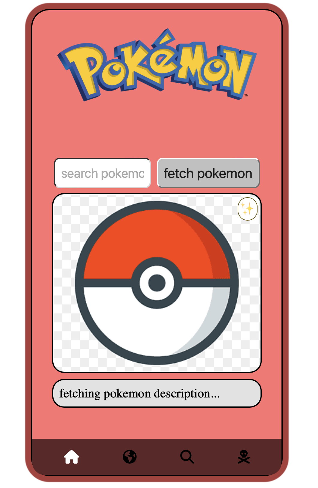
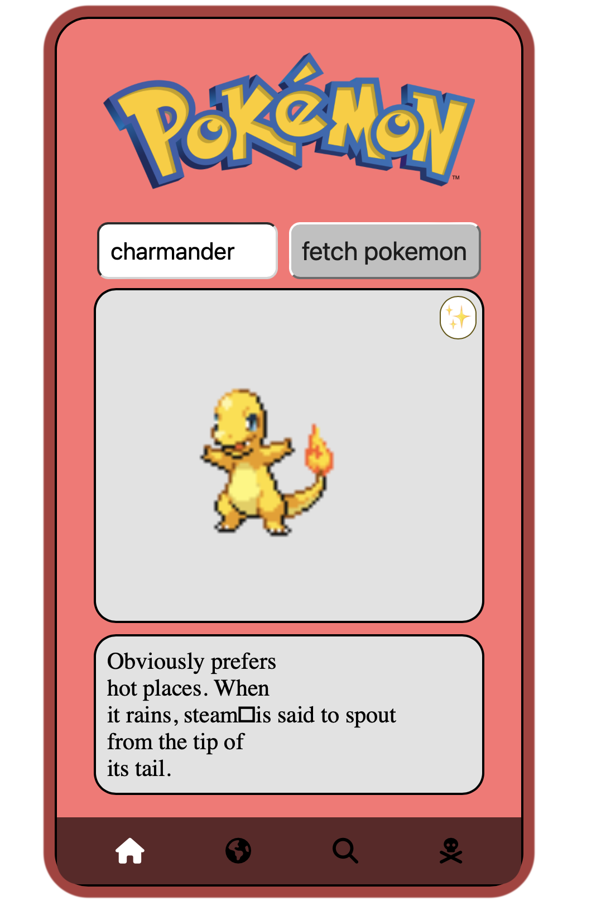
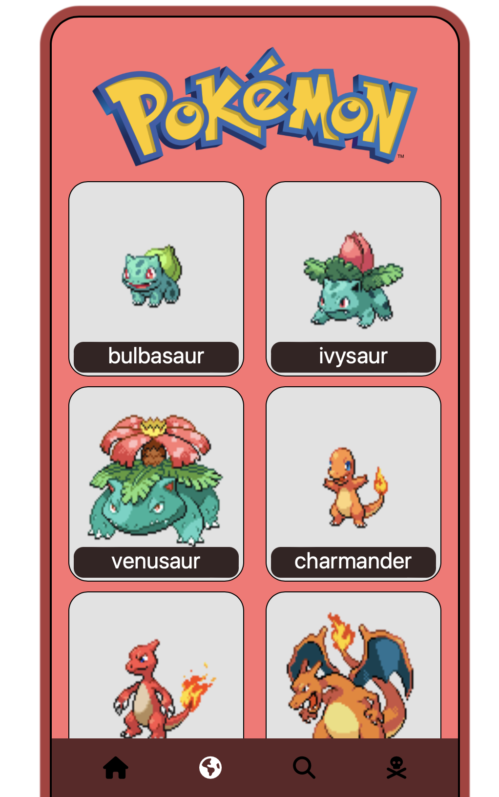

# Project Pokedex

#### This Project makes use of `pokeapi` , If you are familiar with Javascript please feel free to contribute to this project.

## Screenshots

### 1) home page
<!--  -->

### 2) Search pokemon

### 3) Explore pokemon

## License
Distributed under the MIT License. See `LICENSE` for more information.
